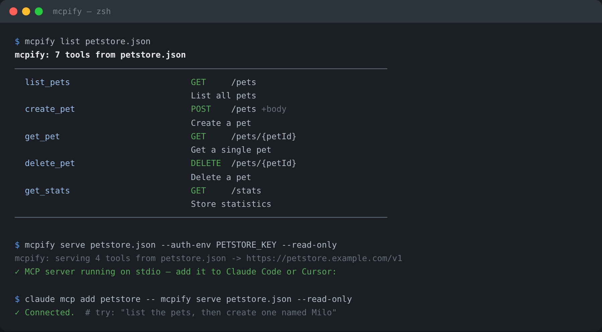

# 🔌 mcpify


[](https://github.com/furkan708/mcpify/actions/workflows/ci.yml)  


**Turn any OpenAPI REST API into an [MCP](https://modelcontextprotocol.io) server** — so Claude Code, Cursor, and every other MCP client can call your API directly. One command. Zero dependencies.



Your company has a REST API. Your AI agent needs to call it. Until now that
meant hand-writing a custom MCP server for every API. With mcpify:

```bash
mcpify serve https://your-company.com/openapi.json
```

That's it — every endpoint just became a tool your AI agent can discover, understand, and call.

📖 **Deep docs:** [Usage guide](docs/USAGE.md) — auth patterns, scoping, Docker, troubleshooting · [Architecture](docs/ARCHITECTURE.md) · [Contributing](CONTRIBUTING.md) · [Changelog](CHANGELOG.md) · [Security](SECURITY.md)

## ✨ Why you'll like it

- ⚡ **60 seconds to working** — point it at any OpenAPI 3.x spec (file or URL)
- 🔐 **Credentials never touch the spec or the model** — pulled from your
  environment at call time (`--auth-env`), sent as `Authorization: Bearer`,
  a custom header, or a query parameter
- 🧰 **Every operation becomes a first-class MCP tool** — input schemas are
  generated from `parameters` + `requestBody`, internal `$ref`s are resolved
- 🎚️ **Scope it down** — `--read-only` (GET only), `--tag payments`,
  `--include /v1/orders`, `--exclude /admin` — great for giving agents the
  safe subset
- 🩺 **`mcpify doctor`** — tells you if your spec is agent-friendly before you ship
- 🪶 **Zero dependencies** — one pure-Python file tree; YAML specs need an
  optional `pip install 'mcpify[yaml]'`
- 🧪 **53 tests** including a full end-to-end suite against a real local HTTP API

## 🚀 Quick start

```bash
git clone https://github.com/furkan708/mcpify.git
cd mcpify && pip install .

# 1. preview the tools that will be generated
mcpify list examples/petstore.json

# 2. validate the spec is agent-friendly
mcpify doctor examples/petstore.json

# 3. serve it over MCP
mcpify serve examples/petstore.json --base-url https://petstore.example.com/v1
```

### With authentication

```bash
# Bearer token read from the environment (never hardcoded)
export PETSTORE_KEY="sk-..."
mcpify serve petstore.json \
  --base-url https://petstore.example.com/v1 \
  --auth-env PETSTORE_KEY \
  --auth-style bearer \
  --read-only
```

| Flag | Meaning |
| ---- | ------- |
| `--auth-env VAR` | environment variable holding the credential |
| `--auth-style bearer\|header\|query` | how it is sent |
| `--auth-name NAME` | header / query name for non-bearer styles (e.g. `X-API-Key`) |

## 🤖 Plug it into your agent

**Claude Code:**

```bash
claude mcp add my-api -- mcpify serve openapi.json --read-only
```

**Claude Desktop / Cursor / any MCP client** (`claude_desktop_config.json`):

```json
{
  "mcpServers": {
    "petstore": {
      "command": "mcpify",
      "args": ["serve", "~/specs/petstore.json", "--auth-env", "PETSTORE_KEY"]
    }
  }
}
```

Now ask your agent: *"list the pets, then create one named Milo"* — it discovers `list_pets` and `create_pet`, fills the arguments, and performs real HTTP calls.

## 🔍 How operations become tools

| OpenAPI | mcpify |
| ------- | ------ |
| `operationId` | tool name (sanitized; falls back to `method_path`) |
| `summary` / `description` | tool description the agent reads |
| `parameters` (path/query/header) | individual typed arguments with enums |
| `requestBody` (JSON) | a `body` object argument |
| `$ref` pointers | resolved inline (components → real schemas) |
| `servers[0].url` | default base URL (override: `--base-url`) |

The agent only ever sees the tool list and your API's JSON responses —
mcpify adds no middleware, caches nothing, and sends credentials nowhere
except your API.

## 🩺 Doctor

```bash
$ mcpify doctor my-api.json
openapi: 3.0.3
title:   Acme API
paths:   23
tools:   41 operations
servers: https://api.acme.com
warning: 12/41 operations have no operationId (names fall back to method_path)
warning: 30/41 operations have no summary (agents see no description)
```

## 📖 CLI reference

```
mcpify list <spec> [--tag T] [--include P] [--exclude P] [--read-only] [--json]
mcpify serve <spec> [--base-url URL] [--name N] [--auth-env VAR]
                    [--auth-style bearer|header|query] [--auth-name NAME]
                    [--timeout S] [--read-only] [--tag T] [--include P] [--exclude P]
mcpify doctor <spec>
```

### Notes & limitations

- JSON specs work out of the box; YAML specs need `pip install 'mcpify[yaml]'`
- Only local `$ref` pointers are resolved (bundle external docs first — most tools do anyway)
- Request bodies are exposed as a single `body` object argument — predictable over clever
- Spec versions: OpenAPI 3.x and Swagger 2.x roots are accepted; 3.x is the happy path

## 🧪 Tests

```bash
pip install pytest pyyaml
pytest -v
```

The e2e suite boots a real local HTTP API and drives the full MCP protocol
over stdio — initialize → tools/list → tools/call — and asserts on the HTTP
requests that hit the wire.

## 🗂️ Project Structure

```
mcpify/
├── mcpify/
│   ├── spec.py        # OpenAPI loading, $ref resolution, operation walking
│   ├── tools.py       # operation -> MCP tool, argument -> HTTP request
│   ├── http_client.py # execution (urllib, HTTP errors become tool results)
│   ├── api_server.py  # MCP stdio server (JSON-RPC 2.0)
│   └── cli.py         # list / serve / doctor
├── examples/petstore.json
└── tests/
```

## 🗺️ Roadmap

- [ ] `--output-server FILE` — generate a standalone, shareable server script
- [ ] Per-operation rate limiting
- [ ] OAuth2 client-credentials flow

## 📄 License

MIT — see the [LICENSE](LICENSE) file for details.
