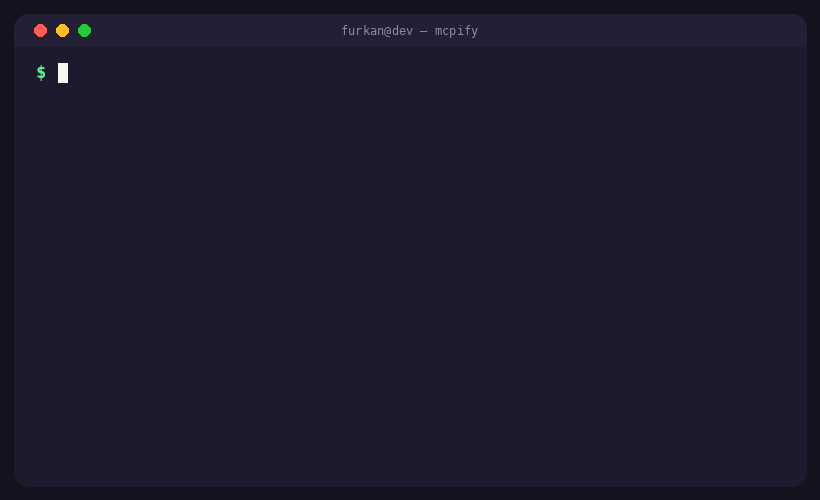

<!-- mcp-name: io.github.furkan708/mcpify -->

# mcpify

[](https://www.python.org/)


English | [Türkçe](README.tr.md)

<p align="center">
  
</p>

[](https://github.com/furkan708/mcpify/actions/workflows/ci.yml)
[](https://github.com/furkan708/mcpify/actions/workflows/codeql.yml)
[](.github/workflows/ci.yml)
[](server.json)
[](https://github.com/furkan708/mcpify/actions/workflows/ci.yml)
[](https://www.python.org/)
[](https://github.com/astral-sh/ruff)
[](https://mypy-lang.org/)
[](https://pypi.org/project/mcpify-openapi/)
[](https://pypi.org/project/mcpify-openapi/)
[](https://docs.astral.sh/uv/)


**Turn any OpenAPI REST API into an [MCP](https://modelcontextprotocol.io) server** — so Claude Code, Cursor, and every other MCP client can call your API directly. One command. Zero dependencies.


Your company has a REST API. Your AI agent needs to call it. Until now that
meant hand-writing a custom MCP server for every API. With mcpify:

```bash
mcpify serve https://your-company.com/openapi.json
```

That's it — every endpoint just became a tool your AI agent can discover, understand, and call.

**Deep docs:** [Usage guide](docs/USAGE.md) — auth patterns, scoping, Docker, troubleshooting · [Architecture](docs/ARCHITECTURE.md) · [Contributing](CONTRIBUTING.md) · [Changelog](CHANGELOG.md) · [Security](SECURITY.md)

**The launch story:** [How a live weather API broke this tool — and made it better](https://dev.to/furkan708/i-connected-a-real-weather-api-to-claude-in-3-commands-and-the-community-broke-my-tool-in-the-3jid)

## Why you'll like it

- **60 seconds to working** — point it at any OpenAPI 3.x spec (file or URL)
- **Credentials never touch the spec or the model** — pulled from your
  environment at call time (`--auth-env`), sent as `Authorization: Bearer`,
  a custom header, or a query parameter
- **Every operation becomes a first-class MCP tool** — input schemas are
  generated from `parameters` + `requestBody`, internal `$ref`s are resolved
- **Scope it down** — `--read-only` (GET only), `--tag payments`,
  `--include /v1/orders`, `--exclude /admin`, plus a policy layer for real-world
  APIs: `--deny REGEX` hides mutating GETs, `--allow REGEX` re-includes
  read-style POST endpoints. Deny always wins.
- **`mcpify doctor`** — tells you if your spec is agent-friendly before you ship
- **Zero dependencies** — one pure-Python file tree; YAML specs need an
  optional `pip install 'mcpify[yaml]'`
- **Agent-grade surface.** Tool annotations derived from HTTP semantics
  (clients auto-approve read-only tools), structured output via MCP
  `outputSchema`/`structuredContent`, remediation-grade errors that teach the
  next call, dry-run request previews, and a `--lazy` search-then-call mode
  that cut api.weather.gov's listing by **95.5%** (38,882 → 1,741 chars)
- **116 tests across nine suites** — including a full MCP protocol run
  over stdio against a real local HTTP API and the **live
  api.weather.gov document** (69 tools, 16 enum'd parameters)

## Quick start

```bash
# run without installing (uvx — pulls from PyPI on demand)
uvx --from mcpify-openapi mcpify list ./openapi.json --read-only

# or install (installs the `mcpify` command)
pipx install mcpify-openapi

# ...as a container (GHCR, published on every release)
docker run -i ghcr.io/furkan708/mcpify:latest serve ./openapi.json --read-only

# ...or from source
git clone https://github.com/furkan708/mcpify.git
cd mcpify && pip install .

# 1. preview the tools that will be generated
mcpify list examples/petstore.json

# 2. validate the spec is agent-friendly
mcpify doctor examples/petstore.json

# 3. serve it over MCP
mcpify serve examples/petstore.json --base-url https://petstore.example.com/v1
```

### With authentication

```bash
# Bearer token read from the environment (never hardcoded)
export PETSTORE_KEY="sk-..."
mcpify serve petstore.json \
  --base-url https://petstore.example.com/v1 \
  --auth-env PETSTORE_KEY \
  --auth-style bearer \
  --read-only
```

| Flag | Meaning | | ---- | ------- | | `--auth-env VAR` | environment variable holding the credential | | `--auth-style bearer\|header\|query` | how it is sent | | `--auth-name NAME` | header / query name for non-bearer styles (e.g. `X-API-Key`) |

## Plug it into your agent

**Claude Code:**

```bash
claude mcp add my-api -- mcpify serve openapi.json --read-only
```

**Claude Desktop / Cursor / any MCP client** (`claude_desktop_config.json`):

```json
{
  "mcpServers": {
    "petstore": {
      "command": "mcpify",
      "args": ["serve", "~/specs/petstore.json", "--auth-env", "PETSTORE_KEY"]
    }
  }
}
```

Now ask your agent: *"list the pets, then create one named Milo"* — it discovers `list_pets` and `create_pet`, fills the arguments, and performs real HTTP calls.

## How operations become tools

| OpenAPI | mcpify | | ------- | ------ | | `operationId` | tool name (sanitized; falls back to `method_path`) | | `summary` / `description` | tool description the agent reads | | `deprecated: true` | shown by `mcpify list` before you expose old endpoints | | `parameters` (path/query/header) | individual typed arguments with enums | | `requestBody` (JSON) | a `body` object argument | | `$ref` pointers | resolved inline (components → real schemas) | | `servers[0].url` | default base URL (override: `--base-url`) |

The agent only ever sees the tool list and your API's JSON responses —
mcpify adds no middleware, caches nothing, and sends credentials nowhere
except your API.

## Doctor

```bash
$ mcpify doctor my-api.json
openapi: 3.0.3
title:   Acme API
paths:   23
tools:   41 operations
servers: https://api.acme.com
warning: 12/41 operations have no operationId (names fall back to method_path)
warning: 30/41 operations have no summary (agents see no description)
```

## CLI reference

```
mcpify list <spec> [--tag T] [--include P] [--exclude P] [--read-only] [--json]
mcpify serve <spec> [--base-url URL] [--name N] [--auth-env VAR]
                    [--auth-style bearer|header|query] [--auth-name NAME]
                    [--timeout S] [--read-only] [--tag T] [--include P] [--exclude P]
mcpify doctor <spec>
```

### Notes & limitations

- JSON specs work out of the box; YAML specs need `pip install 'mcpify[yaml]'`
- Only local `$ref` pointers are resolved (bundle external docs first — most tools do anyway)
- Request bodies are exposed as a single `body` object argument — predictable over clever
- Spec versions: OpenAPI 3.x and Swagger 2.x roots are accepted; 3.x is the happy path

## Hardened against the real world

mcpify is audited on every release against a 10-category checklist of MCP
best practices and published production failure modes — not just our own
examples:

- **Hostile-spec corpus (12/12):** circular `$ref`s, multipart uploads,
  `allOf` schemas, server URL variables, relative base URLs, oversized
  responses — every scenario derived from a documented real-world failure,
  fixed, and locked in by a regression test. Sources include the arXiv
  study of REST→MCP generation across 18 real APIs.
- **Live integration:** the real api.weather.gov spec loads in CI — the
  case that found (and fixed) our last crash-class bug.
- **MCP lifecycle enforced:** tools are unreachable until the client
  completes the `initialize` handshake.
- **Blast-radius controls:** read-only mode, deny/allow policy layer,
  40k-char response truncation, `--timeout`, credentials never logged.

Full checklist with per-item status: **[docs/AUDIT-CHECKLIST.md](docs/AUDIT-CHECKLIST.md)**

## Tests

**116 passing**, plus one live-integration test that loads the real
api.weather.gov document (auto-skipped when offline). Every suite runs on
Python 3.10–3.12 across Linux and Windows; `ruff`, strict `mypy` and
CodeQL gate every push.

| Suite | Tests | What it pins down |
|---|---:|---|
| Spec parsing & resolution | 13 | OpenAPI 3.x + YAML loading, `$ref` chains, `allOf` merge, server variables, malformed input |
| Tool translation | 19 | operationId naming with collision suffixing, input schemas, enums, body handling, annotation & output-schema derivation |
| Agent surface | 31 | HTTP-derived annotations, structured output contract, remediation errors, `--lazy` search, dry-run previews |
| CLI | 15 | `list` / `doctor` / `serve` flags, `--json` output, deprecated badges |
| Hostile corpus | 11 | circular `$ref`s, multipart bodies, relative base URLs, 300 KB truncation, 500-op performance — each traced to a documented real-world failure |
| Lifecycle & hygiene | 8 | initialize handshake (`-32002`), byte-pure stdio, credentials never logged |
| Protocol end-to-end | 9 | real JSON-RPC over stdio against a live local HTTP API, wire-level assertions |
| Policy layer | 7 | `--read-only`, `--allow` / `--deny` precedence, mutating-GET protection |
| `$ref` parameters | 4 | parameter schemas resolved against the full spec — the weather.gov bug class (one test hits the live document) |

Policy on failures: every bug found in the wild becomes a pinned
regression test before the fix ships — the suite only grows.

Run it locally:

```bash
pip install pytest pyyaml
pytest -v
```

## Project Structure

```
mcpify/
├── mcpify/
│   ├── spec.py        # OpenAPI loading, $ref resolution, operation walking
│   ├── tools.py       # operation -> MCP tool, argument -> HTTP request
│   ├── http_client.py # execution (urllib, HTTP errors become tool results)
│   ├── api_server.py  # MCP stdio server (JSON-RPC 2.0)
│   └── cli.py         # list / serve / doctor
├── examples/petstore.json
└── tests/
```

## Roadmap

- [ ] `--output-server FILE` — generate a standalone, shareable server script
- [ ] Per-operation rate limiting
- [ ] OAuth2 client-credentials flow

## License

MIT — see the [LICENSE](LICENSE) file for details.
